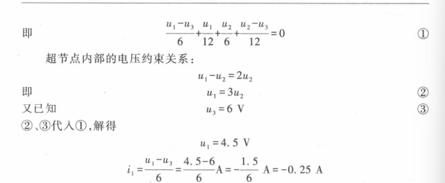
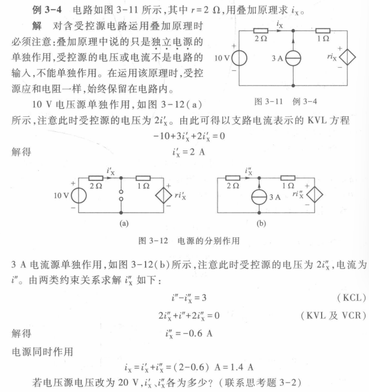
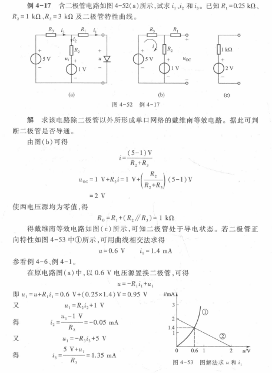
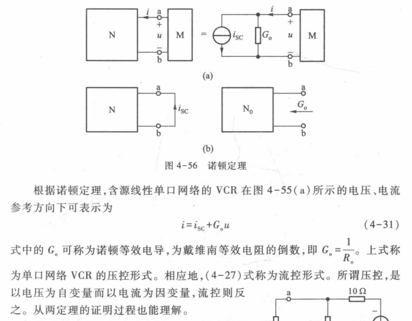
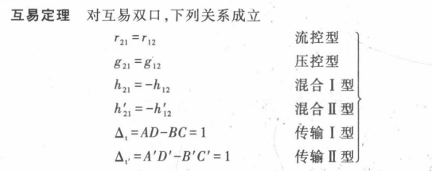
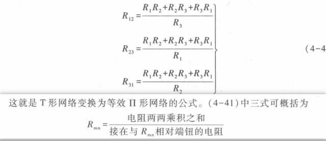
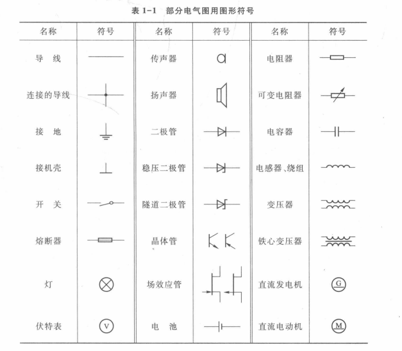

<!--  -->

# 前置知识

### 集总电路

- 元件的特点

- 集总电路的定义及分类

### 参考方向与实际方向

### 电路分析的对象

- 电流
  直流（DC）与交流（AC）
  参考方向

- 电压
  参考极性

- 功率
  意义：能量流动的速率。
  方向：能量流动（传输)的方向；
  
  
  明确：基于能量守恒，提供与吸收在指定某个方向的前提下，绝对值相等，正负号相反。
  
  参考方向：电流流动与电压降的方向相同；
  计算方法：查看电流与电压降的方向关系，若是关联则正常列出，不关联则添个负号，以保证我们始终以参考方向为列式基准。
  相对于参考方向，当功率的实际方向与参考方向相同时 *(在计算中体现为结果为负）* ，功率为正（此时能量流经的该部分吸收能量），反之为负（此时被称为“提供的功率”)。

### 关于SI单位的倍数单位

### 电路的一些概念

1. 回路

2. 节点（与超节点）
   一个元件的两端即是一个。同在一条支路的元件可合并为
   一个含n个节点的电路有n-1个独立回路（能提供独立kcl方程的节点）。
   （如果遇到电阻串电压+使用节点分析，多设一个在两者之间的节点。）

3. 网孔（注意只要轮廓线闭合即可）
   一个n+1孔（含最外围）电路中有n个独立网孔（能提供独立kvl方程的回路）。

4. 有源、无源与含源：
   有源与无源可依据二端电阻能否向外电路提供能量来判定（如负电阻与电压源为有源元件）；“含源“则是

5. 记忆性
   
   无记忆性意味着什么：

# 各种元件介绍

<i>以下若不标注，皆默认为理想状态。 没必要按顺序看，哪个不太清楚了再查。</i>

<i>理想状态：只确定具有一种功能（特性），其他特性皆为该功能成立的延伸。如果讨论，能直接使用的皆只有该功能。</i>

### 电阻（与电导）

  只反映电阻器对电流呈现阻力的性能。
  
  
  
  分为线性（遵循欧姆定律）与非线性；时变与时不变。皆无记忆性。
  电导即为电阻的倒数，单位为S（西门子）。
  电阻功率：至少在本书范围，因R永不小于0，其功率永为正（吸收）。
  $$p(t) = Ri^2(t) = \frac{i^2(t)}{G}$$
  $$ p(t) =  \frac{u^2(t)}{R}=Gu^2(t) $$
  等效电阻/电导：

### 独立源（激励源）
  
  1. 电压源：

      两端永远保持一定电压而不论流过其的电流为多少（负的——如果有负的——也行），导致其既可提供又可吸收能量。

      与电压源并联的元件，其电压即为电压源的电压。

      推论但做题的时候不能直接用否则容易翻车：理想电压源的内阻为0.
  
  2. 理想电流源：

      不论两端电压为多少（意味着其电压存在且不定），永远向外电路提供一定电流的元件。

      与电流源串联的元件，其电流即为电流源的电流。

      推论但做题的时候不能直接用否则容易翻车：理想电流源的内阻为$\infty$。

### 受控源

  是为了便于电路分析而抽象出来的模型；一种受控源可以对应多个电路，并非一个。每一个内部电路原理是不同的。
  
  1. 压控电压源，压控电流源，流控电压源，流控电流源
  
  2. 在解题时：

     1. 可以将其看作是独立源来列kcl、kvl(回路与节点法)，但绝不能真将其视为独立源（地位与电阻类似）（回路、节点以外的任何方法）
     2. 一定要注意激励的存在与否，采取的解题方法会不会将激励嘎了。

### 二极管

### 运算放大器

### 三极管

### 电容

### 电导

# 电路的表示

在求解的时候将上图电路化为网络形式。

# 各种定律

法则：电荷守恒与能量守恒——

### 公理

1. kcl与kvl

   
   

### 其他

#### 网络函数

   线性电路的比例性（于是我们可以通过设数与电路激励与响应之间的比例关系求解问题）

   

#### 置换定理

   一种基于工作点相同的”等效“替换。
   

# 分析方法

   ***当我们开始求解的时候，我们应该先看看各部分支路的电阻电流电压（单元件或多元件/整个支路两端）关系，从而能够少设点未知量、少设点关系方程并更快地求出所需的未知量等等。
   并且，在求的过程中注意能不能直接使用所需未知量来列写方程，回路之间的关系、一些错误思维惯性也要注意到。（见附录）***

### 网孔与节点

   （原理：kvl/kcl）（内部列完了从外部补缺失的！）

   （可能需要补充方程）

   如遇受控源，要么设未知要么来个超网孔/超节点绕过去。

   超xx在无受控源的情况下也适用,用的时候要注意这并不意味着我们直接将该节点看作为拥有一个节点电压$u^{'}$;我们列的是kcl,原各节点的电压还是绕不开的。~~（本人就是这么翻车的）~~

   
    
   
   
   

### 网络函数与叠加

   原理：电场叠加原理、基尔霍夫定律与……

   注意：

   1. 运用叠加原理时可以留下多个独立源，剩下的独立源视为零值；受控源与电阻应被同样对待。

   2. 不能用叠加方法求分功率然后相加，容易翻车。

*网络函数*

   

*叠加原理*

   适用范围：线性电路（电阻，电感，电容等）；

   独立源单独作用，受控源保持不变。

   不用叠加来求功率！
   
   
   

   齐性定理：
      即方程的齐次性；系数成比例变化。

### 分解与变换

#### 原理

   1. 我们往往只需要单口网络的vcr而不是单个元件的VCR（即我们对黑箱子内的构造并不关心）；

   2. 一个元件的u-i关系由元件本身所确定，与外界电路无关；同样，**若一个单口网络除了通过它的两个端钮与外界相连结外，别无其他关系的话，其VCR也是由该端口网络本身所确定**。因此，此时可以在任何外界电路的情况下来求解其VCR。（于是，我们完全可以将外界电路换成最简单的来进行替代，从而求出单口网络的u-i关系；反过来想，只要**u-i关系一致**，我们完全可以用**等效**最简电路来替换单口网络，从而对原电路的另一端来说从未改变；再进一步，只要电路两部分的ui关系曲线相交于同一点（**相同工作点**），我们完全可以进行**置换**。（就是这样极大概率被限制于那一点了）（图见”置换定理“））

#### 单口网络

##### VCR求法

   外施电流求电压/外施电压求电流法，从而解得ui关系。

   （可以看看该网络用方法求解比较简单来确定是定电流源还是电压源。如果网孔最好用电压源；如果节点倾向于电流源）

   注意:
   解的时候不要纠结于缺了一个方程而解不出来——我们要的是关系而不是确定解！！！（当然，如果缺了2个及以上的话就该纠结了）

##### 等效电路

   VCR相同。

   由于网络划分的随意性及内外部网络的影响性质，可以嵌套等效；但相对位置不能乱，毕竟要保证电路的结构“不变”，如两电流源支路之间有一个串联的电阻时，不·准·合·并·电·流·源！！！

   类型：
   (以下如未标明，皆为独立)

   对纯电阻电路：可等效为仅含一个电阻的电路。

   电阻+受控源：同上。不过可能会得到负值电阻。

   

   电压源串联:

   电流源并联：

   电阻串联：

   电阻并联：

   流与压/阻串联：电流是绝对量，从电压视角，麻烦，压/阻”多余“；

   压与流/阻并联：电压是绝对量，从电流视角，麻烦，流/阻”多余“。

   有伴电压源与有伴电流源的互化：
   $$u_1 = i_2R$$
   $$i_2=Gu_1$$
   

##### 戴维南与诺顿

   适用电路：一般的（R不为无穷）、线性的、单口/二端网络。
   
   
   
   
   

   注意，我们讨论的对象该单口网络，u、i的参考方向的关联与否取决于该单口网络（开口端）而不是外电路。

   求法：

   1. 求$u_{oc}$、$i_{sc}$：
      - **叠加法**分着求（记得最后加起来）
      - **断路/短路法**直接求。
         （对于受控源，如果其控制量在端口处，并且为电压，短接万岁！）

   1. 求$R_o$：

      1. 将单口网络独立源或短路、或短路后直接求$R_o$,或用外施电源法求$R_o$。

      （如果内部存在受控源，只能用此方法；可能会求出负电阻。）

      2. 开路短路法：$R_o =\frac{u_{oc}}{i_{sc}}$

注意：

- 从全面求解分解方式是随意的，怎么方便怎么划；但
- 戴维南与诺顿从叠加原理推出，注意事项参见”网络函数与叠加“；
- 对受控源，地位同电阻，且一定要注意控制端有没有被我们嘎掉！！（如果控制端为单口网络的开口处电流与电压或在其内部，那没事了）
  - 如果电路中线性与非线性混合，可以试着将其划分为两部分，再联立/由图可知解得。
  - 叠加方法可使多个激励或复杂激励电路的求解问题化为简单激励电路的求解问题，仅限于线性电路，而分解方法将结构复杂化为结构简单，通用（分而解之）。

#### 二端网络之互易定理

- 双口网络的研究（具体看书吧……）：

      依据线性电路的线性特性与激励变量与相应变量之间的叠加关系列出方程组，并通过取0求得相应系数。然后，依据本人暂未想明白的电路关系，得到了一些等量关系（见下图）.加以延伸，得到互易定理：

- 互易定理：
       
      来源:线性电阻的双向性

      如果两端有

#### 三端最简网络之$T$型与$pi$型电阻的互化

   

   在保证三端的电压/电流皆相同的前提下,使电阻满足下方关系:

   $T$转$pi$:
   

   $pi转T$:
   

# 其他

### 关于关联参考方向与非关联参考方向

<i>做题过程中总是弄混正负号，故还是理一理吧……</i>

我们规定：

- 关联参考方向为：对某一电路部分（导线，元件，网络……），电流的参考方向与电压降的参考方向一致；

- 非关联参考方向即是相反。

于是，对电路的某一部分(某一元件/网络/……），如果流入其的电流的方向箭头指向电压的”+”极，那么该元件的电压与电流便具有关联参考方向。

对于功率的计算与判断吸收or放出：

先依据i与u的方向关系（定下能量流动方向再）判断是否添负号（关联不添非关联添），
此时我们已经确定了该电路部分吸·收·功·率的正方向
；然后看看最终结果是否有负号，没有就是正向的能量流动，即吸收功率为正，有则说明该部分提供功率。

### 一些思维上的注意事项

1. 并联：支路两端的电压分别相等；串联：元件之间的电压呈现“接力”现象。
2. 外接短路线使某支路短路了，其他支路的电流都改道流到了短接线上，但支路本身如果还有电源的话大概率它自身也“产生”电流，该电流同样会被汇聚于短接线上。
3. 方法的使用条件。
4. 网络内部可以嵌套等效，但相对位置不能乱，毕竟要保证电路的结构“不变”。如两电流源支路之间有一个串联的电阻时，不·准·合·并·电·流·源！！！

### 计算问题

1. 注意正负号。
2. 注意关联方向。
3. 注意未知量（不论新设还是本有）的复用。
4. 注意括号，括号外的系数以及括号内的系数（别再直接把括号外的系数直接当成拆了括号后的系数了！T_T）
